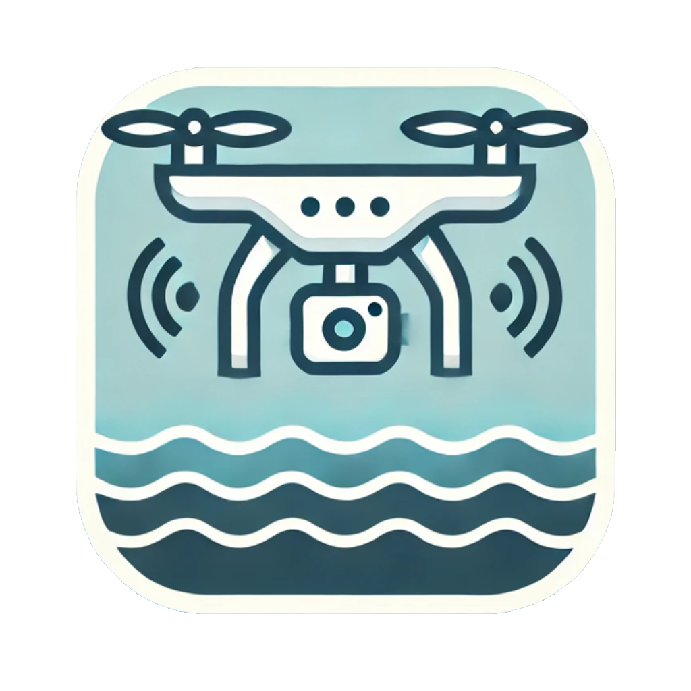
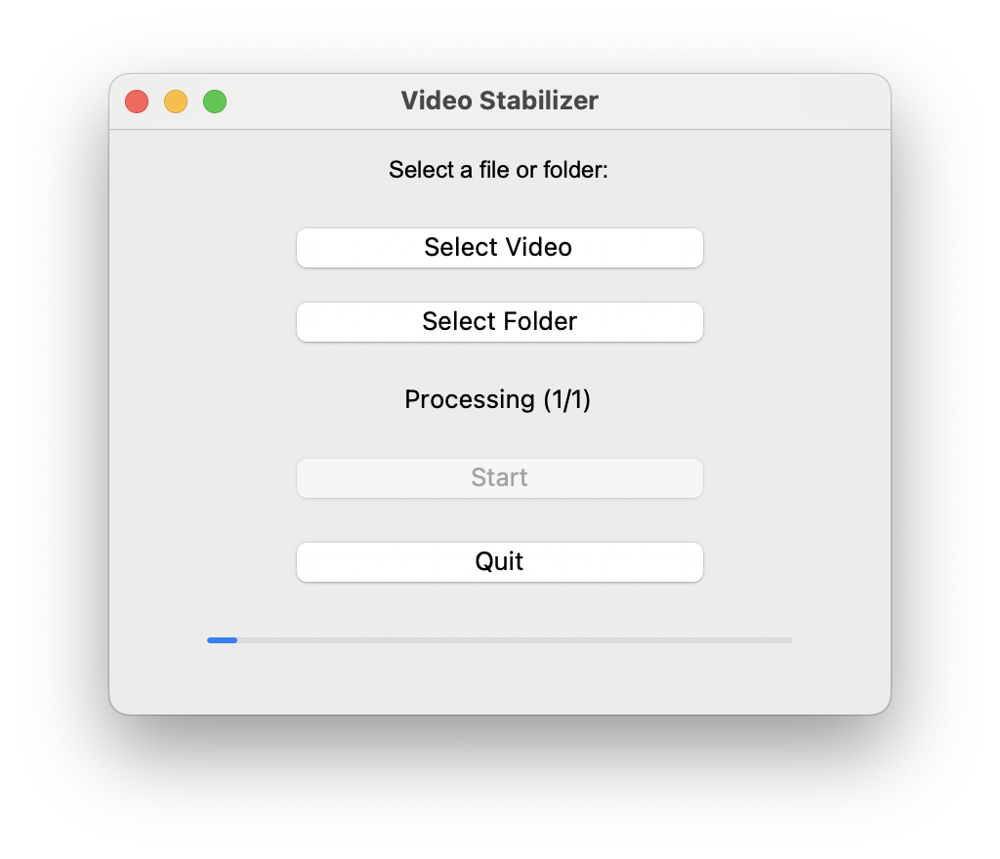

<div align="center">
  
</div>

# Video Stabilizer for stationary Drone Videos

## Overview
Video Stabilizer is a cross-platform tool designed to stabilize drone footage by correcting unwanted rotations and shifts caused by wind. It automatically detects fixed reference points (such as the edges of a swimming pool) and aligns the frames accordingly, ensuring a smooth and stable video output.
It is particularly useful when the footage should be used to extract information, such as for scientific analysis, like track recognition or object detection.

<div align="center">
  
</div>


The application provides both a **graphical user interface (GUI)** for ease of use and a **command-line interface (CLI)** for automation and advanced users.

## Features
- **Automatic video stabilization** using feature detection.
- **Supports single video files and entire folders** for batch processing.
- **Graphical User Interface (GUI)** for easy video selection.
- **Command-Line Interface (CLI)** for advanced users and automation.
- **Cross-platform compatibility** (Windows, macOS, Linux).

## Installation

### Windows & macOS
The latest releases for Windows (`.exe`) and macOS (`.app.zip`) can be downloaded from the [GitHub Releases](https://github.com/YOUR_REPO/releases) page.

1. Download the latest version for your operating system.
2. On macOS, unzip the `.app.zip` file before running.
3. Run the application.

### Linux
For Linux users, download `VideoStabilizer.bin`, make it executable, and run:
```bash
chmod +x VideoStabilizer.bin
./VideoStabilizer.bin
```

### Install via Python (for CLI users)
If you prefer using the CLI version, install via Python using Poetry:
```bash
git clone https://github.com/marine-data-science/drone-video-stabilizer.git
cd drone-video-stabilizer
poetry install
```

## Usage

### Graphical User Interface (GUI)
Simply launch the application and follow these steps:
1. Select a video file or an entire folder.
2. Click "Start" to begin stabilization.
3. The stabilized videos will be saved with `_stabilized` appended to the filename.

<div align="center">
  
</div>


### Command-Line Interface (CLI)
For users who prefer CLI, the application provides a simple command structure:
```bash
poetry run video-stabilizer <Input.mp4> [--output stabilized_video.mp4]
```
#### Options:
- `<Input>`: Specifies the input video file.
- `--output <file>`: Defines the output filename (optional; defaults to appending `_stabilized`).

## App Icon Handling
The application icon (`Icon.png`) must be placed in the `app/icon/` directory. During CI, this icon is automatically converted into the required formats (`.ico`, `.icns`, `.png`) for Windows, macOS, and Linux.
The converted icons are not stored in the repository but are generated on-demand in the build pipeline.

For local testing, you can manually generate the icons by running:
```bash
poetry run generate-icons
```
This command converts `Icon.png` into the necessary formats and stores them in `app/icon/output_icons/`.

## Development
For developers who want to contribute or modify the project:
```bash
git clone https://github.com/marine-data-science/drone-video-stabilizer.git
cd drone-video-stabilizer
poetry install
```

To build the standalone application:
```bash
poetry run generate-icons
poetry run pyinstaller app/VideoStabilizer.spec
```

## Contributing
Contributions are welcome! Feel free to submit issues or pull requests to improve the tool.

## License
This project is licensed under the MIT License.
